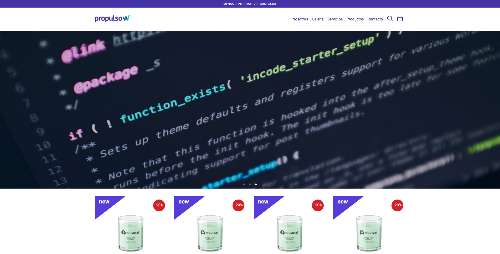
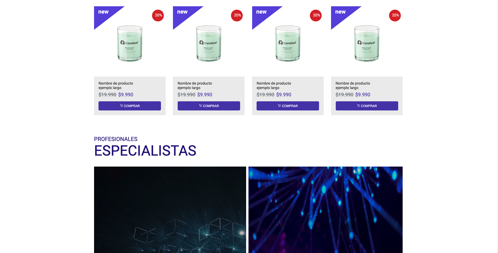
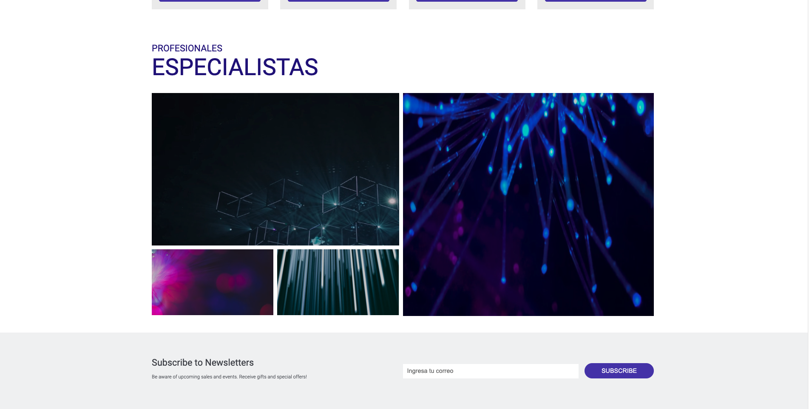

  
    
        
  

# Prueba Front End

Prueba Front-End maquetada en React Js.

## Demo

> 

---

## Funcionalidad del proyecto

Esta Home muestra las secciones a diagramar según indicado en sus tamaños Desktop y Mobile (se agrega certa diagramación extra para transición entre tamaños).

---

_Index_

> 
> 
> 

---

---

**Dependencias del proyecto:**

> - **React Icons:** https://react-icons.github.io/react-icons/
> - **React Responsive Carousel:** https://www.npmjs.com/package/react-responsive-carousel
> - **Sass:** https://create-react-app.dev/docs/adding-a-sass-stylesheet/

**Navegabilidad / Componentes**

> - [x] Responsive / estilos aplicados de forma estética.
> - [x] Manejo de imágenes.
> - [x] PascalCase para componentes.
> - [x] Navbar responsive creado de 0.
> - [x] Hooks.

---
